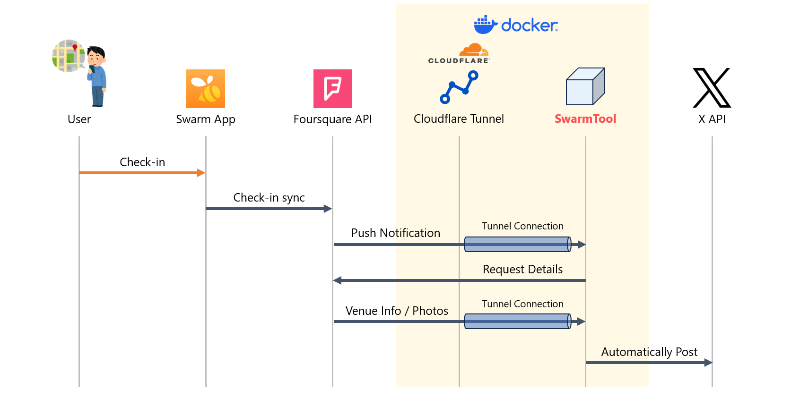

# SwarmNotifier

位置情報共有アプリ [Swarm](https://ja.swarmapp.com/) 向け チェックイン情報X(旧Twitter)自動投稿アプリ

## このアプリについて
2023年7月頃のTwitte API改訂を機に、Swarmチェックイン情報をTwitterへ投稿することはできなくなりました。

本アプリは、FoursquareアカウントとXアカウントを個別に接続することで、Swarmへのチェックイン情報をXへ自動共有します。

アプリケーションの立ち上げには、Foursquare開発者アカウントおよびX API開発者アカウントの両方が必要です。

また、FoursquareおよびXそれぞれにおいてアプリケーション設定を追加し、API Tokenの発行に必要なクライアントID、クライアントシークレットを発行する必要があります。

## 動作仕様


本アプリケーションでは、FoursquareアカウントとXアカウントを相互に結ぶためのアプリケーションを含んだ、2つのコンテナアプリケーションを立ち上げます。

1つ目の「Swarmtool」が本システムの中心アプリであり、FoursquareアカウントおよびXアカウントへのサインインを行い、両サービスのAPI Tokenを内部に保存します。  
また、Node ExpressによるWebサーバ起動を行い、外部からのWeb接続を待ち受ける動作を行います。

2つ目の「cloudflared」は、Swarmtoolを外部公開するためのコンテナとして動作します。（詳細は後述）



Foursquare APIでは、Swarmでのチェックイン時に「Push Notification」という機能によりチェックイン情報がリアルタイムにWebhook通知されます。  
本アプリはこのWebhookをキャッチし、必要な情報を収集したうえでX API経由でXへポストを行います。

Webhookを受信するためにWebサーバを立ち上げる必要がありますが、本アプリケーションではサーバの外部公開を簡易化するためCloudflareが提供する[Cloudflare Tunnel](https://developers.cloudflare.com/cloudflare-one/connections/connect-networks/)を利用したサーバ公開を行います。

Cloudflare Tunnelを用いることにより、自宅ネットワーク内などで本アプリケーションを動作させる場合でもルータ等のNAPT設定の変更（いわゆるポート開放）を行うことなく利用が可能となります。

なお、クラウドサーバ上などで動作させる等Cloudflare Tunnelが不要な場合は、対象コンテナを起動せずSwarmtoolへ直接アクセスをすることも可能です。  
ただし、本システムは動作要件として有効な証明書によるHTTPS待ち受けが必須となっているため、リバースプロキシやALB等を設置して適切にSSL接続の終端を行ってください。  
Swarmtool本体は、ポート3000番でのHTTP待受のみを行い、HTTPS通信には関与しません。

## 使い方

### 1. リポジトリをクローンする
```
$ git clone https://github.com/advancedbear/SwarmNotifier.git
```

### 2. 環境変数を設定する
`sample.env` ファイルを任意のテキストエディタで開いて編集をしてください。各フィールドの設定値は以下の通りです。

| 項目名 | 内容 |
| :--- | --- |
| CLIENT_ID | Foursquareの **OAuth Authentication** 項目内の **Client Id** |
| CLIENT_SECRET | Foursquareの **OAuth Authentication** 項目内の **Client Secret** |
| REDIRECT_URL | `https://<YOUR_WEBSERVER_FQDN>/login` とする。（パスは `/login` で固定） |
| X_CLIENT_ID | X(Twitter) の **Consumer Keys** 項目内の **Consumer Key** |
| X_CLIENT_SECRET | X(Twitter) の **Consumer Keys** 項目内の **Consumer Secret** |
| X_REDIRECT_URL | `https://<YOUR_WEBSERVER_FQDN>/xlogin` とする。（パスは `/xlogin` で固定）  |
| NODE_SESSION_KEY | セッション情報をハッシュ化する際のソルト文字列（何でも良い） |

編集したファイルは、 `.env` というファイル名で同ディレクトリ内に保存してください。

### 3. docker-compose.ymlを編集する
`docker-compose.yml` ファイルを任意のテキストエディタで開いて編集をしてください。

#### Cloudflare Tunnelを利用する場合
ファイル内の `serivces.tunnel.environment.TUNNEL_TOKEN` 項目に、Cloudflare Tunnel管理画面で指定されたトークン値を入力してください。

```
  tunnel:
    restart: always
    image: cloudflare/cloudflared
    command: tunnel run
    environment:
      - TUNNEL_TOKEN=*****************  <= アスタリスク部分にトークン値を入力する
```

Cloudflare Tunnel側のPublic Hostname Page設定におけるService項目では、 `HTTP` :// `swarmtool:3000` と入力してください。  
(コンテナ間接続となるため、localhostでは接続できません。コンテナ名を指定してください。)

#### Cloudflare Tunnelを利用しない場合
ファイル内の `services.tunnel` 配下をすべてコメントアウトまたは削除してください。

```
  # tunnel:
  #   restart: always
  #   image: cloudflare/cloudflared
  #   command: tunnel run
  #   environment:
  #     - TUNNEL_TOKEN=*****************
```

Swarmtoolコンテナの待ち受けポート番号を変更する場合、 `service.swarmtool.ports` 項目の `3000:3000` のうち左辺のポート番号を編集してください。  
(右辺はコンテナ内部の接続ポート番号となるため、3000番固定となります。)

### 4. コンテナを起動する
以下コマンドを実行し、コンテナを起動してください。（バックグラウンドで起動します）

```
$ docker compose up -d
```

起動完了後、以下コマンドを実行してログ末尾に `Server is running on port 3000` と出力されていれば起動しています。

```
$ docker compose logs
```